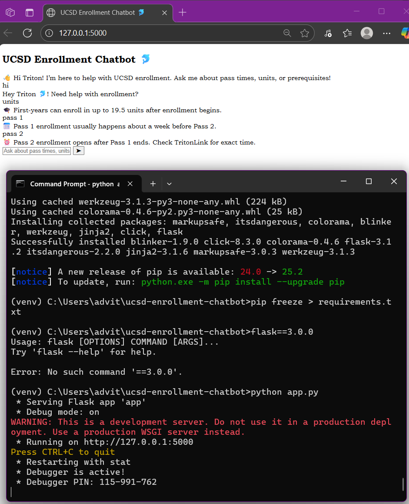

# 🐬 UCSD Enrollment Chatbot

A simple chatbot built with **Flask** that helps UCSD students quickly find enrollment info such as **Pass 1 & Pass 2 times, unit limits, and prerequisites**.  

This was created to make enrollment guidance more accessible and fun with a conversational interface.

---

## ✨ Features
- 💬 Chat interface to ask about enrollment details  
- 📅 Info about Pass 1 & Pass 2 times  
- 🎓 Unit limits explained  
- 🐬 UCSD-themed chatbot responses  
- 🌐 Built with Python + Flask + HTML/CSS  

---

## 🚀 Demo
  

---

## 🛠️ Installation & Run Locally
Clone the repo:
```bash
git clone https://github.com/advitabathole/ucsd-enrollment-chatbot.git
cd ucsd-enrollment-chatbot
